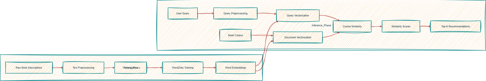
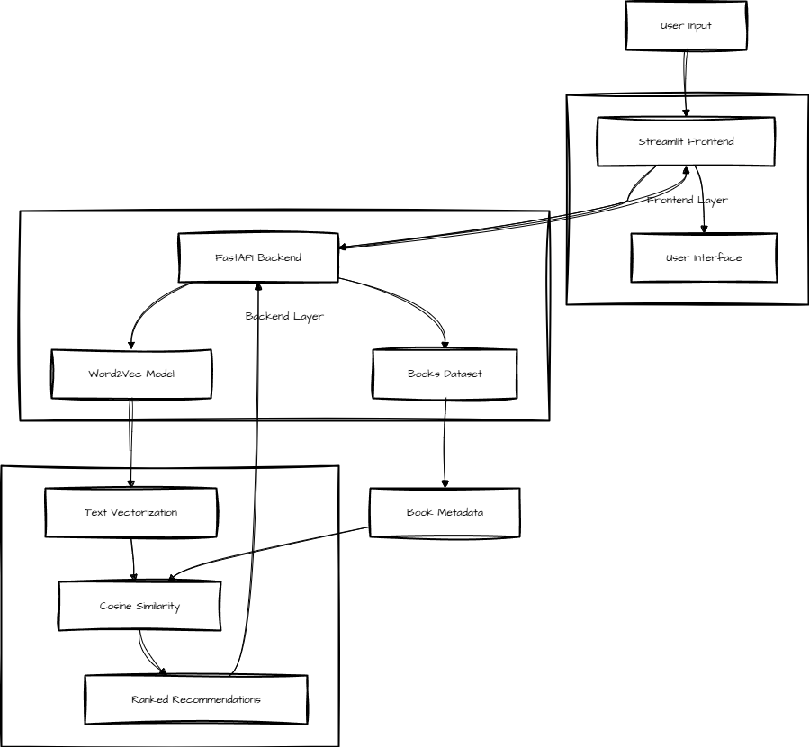

🛠️ Technologies Used
---------------------

*   **Python 3.11**
    
*   **FastAPI** → backend API
    
*   **Streamlit** → frontend UI
    
*   **Gensim** → Word2Vec embeddings
    
*   **Scikit-learn** → cosine similarity
    
*   **Pandas / NumPy** → data handling
    
*   **Joblib** → model serialization
    
*   **Docker** → containerization
    
*   **Render** → cloud deployment
    

⚙️ Setup (Local Development)
----------------------------

### 1\. Clone the repo

code Bashdownloadcontent\_copyexpand\_less

Plain textANTLR4BashCC#CSSCoffeeScriptCMakeDartDjangoDockerEJSErlangGitGoGraphQLGroovyHTMLJavaJavaScriptJSONJSXKotlinLaTeXLessLuaMakefileMarkdownMATLABMarkupObjective-CPerlPHPPowerShell.propertiesProtocol BuffersPythonRRubySass (Sass)Sass (Scss)SchemeSQLShellSwiftSVGTSXTypeScriptWebAssemblyYAMLXML    `git clone https://github.com/Manish3451/Book-Recommendation-System.git  cd Book-Recommendation-System`  

### 2\. Create virtual environment

code Bashdownloadcontent\_copyexpand\_lessIGNORE\_WHEN\_COPYING\_STARTIGNORE\_WHEN\_COPYING\_END

Plain textANTLR4BashCC#CSSCoffeeScriptCMakeDartDjangoDockerEJSErlangGitGoGraphQLGroovyHTMLJavaJavaScriptJSONJSXKotlinLaTeXLessLuaMakefileMarkdownMATLABMarkupObjective-CPerlPHPPowerShell.propertiesProtocol BuffersPythonRRubySass (Sass)Sass (Scss)SchemeSQLShellSwiftSVGTSXTypeScriptWebAssemblyYAMLXML    `python -m venv .venv  source .venv/bin/activate   # Linux/Mac  .venv\Scripts\activate      # Windows`  

### 3\. Install dependencies

code Bashdownloadcontent\_copyexpand\_lessIGNORE\_WHEN\_COPYING\_STARTIGNORE\_WHEN\_COPYING\_END

Plain textANTLR4BashCC#CSSCoffeeScriptCMakeDartDjangoDockerEJSErlangGitGoGraphQLGroovyHTMLJavaJavaScriptJSONJSXKotlinLaTeXLessLuaMakefileMarkdownMATLABMarkupObjective-CPerlPHPPowerShell.propertiesProtocol BuffersPythonRRubySass (Sass)Sass (Scss)SchemeSQLShellSwiftSVGTSXTypeScriptWebAssemblyYAMLXML    `pip install --upgrade pip setuptools wheel  pip install -r requirements.txt`  

### 4\. Run backend (FastAPI)

code Bashdownloadcontent\_copyexpand\_lessIGNORE\_WHEN\_COPYING\_STARTIGNORE\_WHEN\_COPYING\_END

Plain textANTLR4BashCC#CSSCoffeeScriptCMakeDartDjangoDockerEJSErlangGitGoGraphQLGroovyHTMLJavaJavaScriptJSONJSXKotlinLaTeXLessLuaMakefileMarkdownMATLABMarkupObjective-CPerlPHPPowerShell.propertiesProtocol BuffersPythonRRubySass (Sass)Sass (Scss)SchemeSQLShellSwiftSVGTSXTypeScriptWebAssemblyYAMLXML    `uvicorn app.api:app --reload --host 0.0.0.0 --port 8000`  

Visit → [http://localhost:8000/docs](https://www.google.com/url?sa=E&q=http://localhost:8000/docs)

### 5\. Run frontend (Streamlit)

code Bashdownloadcontent\_copyexpand\_lessIGNORE\_WHEN\_COPYING\_STARTIGNORE\_WHEN\_COPYING\_END

Plain textANTLR4BashCC#CSSCoffeeScriptCMakeDartDjangoDockerEJSErlangGitGoGraphQLGroovyHTMLJavaJavaScriptJSONJSXKotlinLaTeXLessLuaMakefileMarkdownMATLABMarkupObjective-CPerlPHPPowerShell.propertiesProtocol BuffersPythonRRubySass (Sass)Sass (Scss)SchemeSQLShellSwiftSVGTSXTypeScriptWebAssemblyYAMLXML    `streamlit run app/streamlit_app.py --server.port=8501`  

Visit → [http://localhost:8501](https://www.google.com/url?sa=E&q=http://localhost:8501)

🚀 Deployment on Render
-----------------------

### Backend (API)

*   Dockerfile: Dockerfile.api
    
*   code Bashdownloadcontent\_copyexpand\_lessIGNORE\_WHEN\_COPYING\_STARTIGNORE\_WHEN\_COPYING\_END uvicorn app.api:app --host 0.0.0.0 --port 8000
    
*   code Codedownloadcontent\_copyexpand\_lessIGNORE\_WHEN\_COPYING\_STARTIGNORE\_WHEN\_COPYING\_END MODEL\_URL=https://github.com/Manish3451/Book-Recommendation-System/releases/download/v1.0-model/books\_w2v.pkl
    

### Frontend (UI)

*   Dockerfile: Dockerfile.ui
    
*   code Bashdownloadcontent\_copyexpand\_lessIGNORE\_WHEN\_COPYING\_STARTIGNORE\_WHEN\_COPYING\_END streamlit run app/streamlit\_app.py --server.port=8501 --server.address=0.0.0.0
    

✅ Both services are deployed separately on Render and communicate via the API URL (set in UI).

🧑‍💻 Usage
-----------

1.  **Enter a description** (e.g., “A young wizard battles dark forces”)
    
2.  Or **choose a seed index** (row number from dataset)
    
3.  **Select number of recommendations** → click Get Recommendations
    
4.  **View results**: title, author, genre, similarity score in a table + list view

📸 Architecture Diagrams
------------------------

### System Architecture

### Model Architecture

📂 Project Structure
--------------------

code Codedownloadcontent\_copyexpand\_lessIGNORE\_WHEN\_COPYING\_STARTIGNORE\_WHEN\_COPYING\_END

Plain textANTLR4BashCC#CSSCoffeeScriptCMakeDartDjangoDockerEJSErlangGitGoGraphQLGroovyHTMLJavaJavaScriptJSONJSXKotlinLaTeXLessLuaMakefileMarkdownMATLABMarkupObjective-CPerlPHPPowerShell.propertiesProtocol BuffersPythonRRubySass (Sass)Sass (Scss)SchemeSQLShellSwiftSVGTSXTypeScriptWebAssemblyYAMLXML    `Book-Recommendation-System/  ├── app/  │   ├── api.py              # FastAPI backend  │   └── streamlit_app.py    # Streamlit frontend  ├── scripts/  │   └── build_tfidf_and_save.py  # Preprocessing & model building helpers  ├── data/  │   ├── books.csv           # Raw dataset  │   └── books_w2v.pkl       # Word2Vec model (downloaded at runtime)  ├── Dockerfile.api          # Backend container  ├── Dockerfile.ui           # Frontend container  ├── requirements.txt        # Python dependencies  ├── README.md               # Project documentation  └── .gitignore              # Git ignored files`  

🤝 Contributing
---------------

Contributions welcome!

1.  Fork repo
    
2.  Create feature branch → git checkout -b feature/my-feature
    
3.  Commit changes → git commit -m "Add my feature"
    
4.  Push branch → git push origin feature/my-feature
    
5.  Open Pull Request
    

📜 License
----------

This project is licensed under the MIT License. See the [LICENSE](https://www.google.com/url?sa=E&q=LICENSE) file for details.

📬 Contact
----------

Manish Mandal

*   **GitHub**: [Manish3451](https://www.google.com/url?sa=E&q=https://github.com/Manish3451)
    
*   **LinkedIn**: \[Your LinkedIn Profile Link\]
    
*   **Email**: \[Your Email Address\]

