# 📚 Book Recommendation System

This project implements a **Book Recommendation System** that suggests books to users based on their preferences. The system leverages natural language processing (NLP) techniques, specifically **Word2Vec**, to understand book similarities and provide relevant recommendations. It features a **FastAPI backend**, a **Streamlit frontend**, and is deployable with Docker and Render.

---

## 📑 Table of Contents
- [Features](#features)
- [System Architecture](#system-architecture)
- [Technologies Used](#technologies-used)
- [Setup and Installation](#setup-and-installation)
- [Usage](#usage)
- [Project Structure](#project-structure)
- [Contributing](#contributing)
- [License](#license)
- [Contact](#contact)

---

## ✨ Features
- **Content-Based Recommendations**: Suggests books based on their descriptions using semantic similarity.
- **Interactive Web Interface**: A user-friendly UI built with Streamlit.
- **Scalable API**: FastAPI backend for efficient recommendation serving.
- **Word2Vec Embeddings**: Generates dense semantic vector representations for books.
- **Cosine Similarity**: Measures similarity between book embeddings for recommendations.

---

## 🏗️ System Architecture

The system follows a layered design to ensure modularity, scalability, and maintainability.

```mermaid
flowchart TB
  subgraph UI["🎨 Frontend Layer"]
    U[User] --> S[Streamlit Web App]
  end

  subgraph API["⚡ API Layer"]
    S --> A[FastAPI API Server]
    A --> R[/recommend Endpoint/]
  end

  subgraph ML["🧠 ML Model Layer"]
    R --> W2V[Word2Vec Model]
    W2V --> E[Book Embeddings]
    E --> CS[Cosine Similarity]
  end

  subgraph Data["🗂️ Data Layer"]
    CS --> PKL[(books_w2v.pkl)]
    PKL --> CSV[books.csv]
  end

  CS --> A
  A --> S
  S --> U
```

Layers:

Frontend Layer (Streamlit Web App)

Provides UI for users to input book descriptions or pick a seed index.

Displays top recommendations.

Communicates with FastAPI backend.

API Layer (FastAPI Server)

Exposes /recommend and /health endpoints.

Processes input queries and returns ranked recommendations.

ML Model Layer (Word2Vec + Cosine Similarity)

Trains Word2Vec embeddings from book descriptions.

Computes similarity using cosine similarity.

Data Layer (Persistent Storage)

books.csv: raw dataset of books (title, authors, genres, descriptions).

books_w2v.pkl: serialized Word2Vec model and averaged embeddings.

🛠️ Technologies Used

Python 3.11

Streamlit → frontend UI

FastAPI → backend API

Gensim → Word2Vec model

Pandas → data manipulation

Scikit-learn → cosine similarity

Uvicorn → ASGI server

Docker & Render → deployment

⚙️ Setup and Installation
1. Clone the Repository
git clone https://github.com/Manish3451/Book-Recommendation-System.git
cd Book-Recommendation-System

2. Create Virtual Environment
python -m venv .venv
source .venv/bin/activate    # On Linux/Mac
.\.venv\Scripts\Activate     # On Windows

3. Install Dependencies
pip install --upgrade pip setuptools wheel
pip install -r requirements.txt

4. Prepare Data & Train Model

Ensure data/books.csv exists. Generate embeddings if books_w2v.pkl is missing:

python scripts/build_tfidf_and_save.py

🚀 Usage
Run FastAPI Backend
uvicorn app.api:app --reload --host 0.0.0.0 --port 8000

Health check: http://localhost:8000/health

Recommendations: http://localhost:8000/recommend?desc=A+fantasy+adventure&top_k=5

Run Streamlit Frontend
streamlit run streamlit_app.py --server.port 8501

UI available at: http://localhost:8501

📂 Project Structure
Book-Recommendation-System/
├── app/
│   └── api.py                 # FastAPI backend
├── data/
│   ├── books.csv              # Dataset of books
│   └── books_w2v.pkl          # Word2Vec embeddings & model
├── scripts/
│   └── build_tfidf_and_save.py # Script to train and save embeddings
├── streamlit_app.py           # Streamlit frontend
├── requirements.txt           # Dependencies
├── Dockerfile.api             # FastAPI container build
├── Dockerfile.ui              # Streamlit container build
├── render.yaml                # Render deployment config
├── .gitignore
└── README.md

🤝 Contributing

Contributions are welcome! To contribute:

Fork this repo

Create a branch: git checkout -b feature/my-feature

Commit changes: git commit -m 'Add new feature'

Push: git push origin feature/my-feature

Open a Pull Request

📜 License

This project is licensed under the MIT License — see the LICENSE
 file for details.

